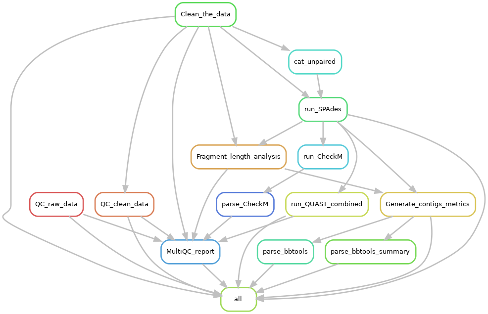

---
output:
  pdf_document: default
  html_document: default
---
# Juno-assembly pipeline {#juno-assembly}

<style>
body {
text-align: justify}
</style>

```{r , include=FALSE}
knitr::opts_chunk$set(echo = TRUE, 
                      eval = FALSE)
```

```{r echo = FALSE, eval = TRUE}
# Parameters
parameters <- list("pipeline_name" = "Juno-assembly")

```

```{r juno-assembly-logo, out.width="70%", fig.align = 'center', echo = FALSE, eval = TRUE}

```

The goal of this pipeline is to generate assemblies from raw fastq files. The input of the pipeline is raw Illumina paired-end data in the form of two fastq files (with extension .fastq, .fastq.gz, .fq or .fq.gz), containing the forward and the reversed reads ('R1' and 'R2' must be part of the file name, respectively). On the basis of the generated genome assemblies, low quality and contaminated samples can be excluded for downstream analysis. __Note:__ The pipeline has been tested only in gastroenteric bacteria ( _Salmonella_, _Shigella_, _Listeria_ and STEC) but it could theoretically be used in other genera/species.

The pipeline uses the following tools:  

1. [FastQC](https://www.bioinformatics.babraham.ac.uk/projects/fastqc/) (Andrews, 2010) is used to assess the quality of the raw Illumina reads  
2. [Trimmomatic](http://www.usadellab.org/cms/?page=trimmomatic) (Bolger, Lohse, & Usadel, 2014) is used to remove poor quality data and adapter sequences. The sliding window option of Trimmomatic starts scanning at the 5’ end and clips the read once the average quality within the window falls below a threshold. The sliding window is the number of nucleotides over which Trimmomatic calculates an average phred quality score, a measure of the quality of the identification of the nucleobases generated by automated DNA sequencing. The Trimmomatic minlen config parameter is set to 50, this parameter is used to drop the read if the read is below a specific length.  
3. FastQC is used once more to assess the quality of the trimmed reads  
4. [Picard](https://broadinstitute.github.io/picard/) determines the library fragment lengths  
5. The reads are assembled into scaffolds by [SPAdes](https://cab.spbu.ru/software/spades/) (Bankevich et al., 2012) by means of _de novo_ assembly of the genome. SPAdes uses k-mers for building an initial de Bruijn graph and on following stages it performs graph-theoretical operations to assemble the genome. Kmer sizes of 21, 33, 55, 77 and 99 were used. For _de novo_ assembly, SPAdes isolate mode is used.   
6. [QUAST](http://quast.sourceforge.net/) (Gurevich, Saveliev, Vyahhi, & Tesler, 2013) is used to assess the quality of the filtered scaffolds.   
7. To assess the quality of the microbial genomes, [CheckM](https://ecogenomics.github.io/CheckM/) (Parks, Imelfort, Skennerton, Hugenholtz, & Tyson, 2015) is used. CheckM calculates scores for completeness, contamination and strain heterogeneity.   
8. [Bbtools](https://jgi.doe.gov/data-and-tools/bbtools/) (Bushnell, 2014) is used to generate scaffold alignment metrics.   
9. [MultiQC](https://multiqc.info/) (Ewels, Magnusson, Lundin, & Käller, 2016) is used to summarize analysis results and quality assessments in a single report for dynamic visualization.  

```{r echo = FALSE, eval = TRUE}

```

## Handbook

### Requirements and preparation

See the [General Instructions for all pipelines](#general-instructions) first.  

- You have different possibilities to run the complete pipeline.  
    + Your input directory should contain samples with just ONE genus type. If this is the case, you should tell the pipeline which genus you have (e.g. using the flag --genus Salmonella). Read further for more details.  
    + You have to make sure that your sample was listed in the Excel file: /data/BioGrid/NGSlab/BAC_in_house_NGS/In-house_NGS_selectie_2021.xlsx (look at the first sheet) and that a genus was provided in the appropriate column. If this is not the case DO NOT MODIFY THAT EXCEL FILE! Instead follow the steps mentioned in the Troubleshooting section, particularly in the part "Error saying that my samples cannot be found on the Excel file with the genus list"  
    + You could skip the step that uses the CheckM tool. That step is the only one that actually requires the information about the genus. You would be missing the statistics about how complete the assembly is with respect to the reference genome.  

### Download the pipeline  

**YOU NEED TO DOWNLOAD THE PIPELINE ONCE OR EVERY TIME YOU WANT TO UPDATE IT**

Please follow the [instructions to download pipelines](#downloading-instructions) from the Juno team of the IDS-bioinformatics group. The `r parameters$pipeline_name` pipeline can be found in [this link](https://github.com/AleSR13/Juno_pipeline).  


### Start the analysis. Basics

1. Open a terminal. (Applications > terminal).  
2. Enter the folder of the pipeline using:  

```{bash}
cd /mnt/scratch_dir/<my_folder>/Juno_pipeline
```

3. Run the pipeline  

If all your samples have the same genus, for instance, _Salmonella_, you run it like this:

```{bash}
bash juno -i /mnt/scratch_dir/<my_folder>/<my_data>/ --genus Salmonella
```
* Note that the genus should be ONE word. Do not put any species names!

If your samples do not have all the same genus but they are present in the file `/data/BioGrid/NGSlab/BAC_in_house_NGS/In-house_NGS_selectie_2021.xlsx`, then do:

```{bash}
bash juno -i /mnt/scratch_dir/<my_folder>/<my_data>/
```

If you do not manage to use any of these steps or you prefer to skip the step with CheckM (this step calculates genome completeness and gives a proxy of contamination) then do:

```{bash}
bash juno -i /mnt/scratch_dir/<my_folder>/<my_data>/ --no-genus
```

Please read the section [What to expect while running a Juno pipeline](#what-to-expect)

See the section [General Troubleshooting](#general-troubleshooting) for any problems you may encounter. 

**Note:** Do not keep all your data (including results) on the scratch_dir partition. You are allowed to keep 400GB max and with sequencing data, this can get full quite fast.

### Output 

A folder called `out/`, inside the folder of the pipeline, will be created. This folder will contain all the results and logging files of your analysis. There will be one folder per result (`qc_raw_fastq`, `clean_fastq`, `qc_clean_fastq`, `de_novo_assembly`, `de_novo_assembly_filtered`, `qc_de_novo_assembly`). Please refer to the manuals of every tool to interpret the results. .  

*Note:* If you want your output to be stored in a folder with a different name or location, you can use the option `-o` ('o' from output) 

```{bash}
bash juno -i /mnt/scratch_dir/<my_folder>/<my_data>/ -o /mnt/scratch_dir/<my_folder>/<my_results>/
```

Another very important output from the pipeline are the logging files and audit trail that contain information of the software versions used, the parameters used, the error messages, etc. They could be important for you if you want to publish or reproduce the analysis at a later timepoint and also to get help from the bioinformatics team if you were to run into trouble with the pipeline. Please read about these files [here](#general-output). 

### Troubleshooting for this pipeline

**Please read first the [General Troubleshooting](#general-troubleshooting) section!**

#### Error saying that the genus supplied was not recognized by CheckM  

If you get this message: 

```
ERROR:  The genus supplied with the sample(s):  
    Sample_name1  
    Sample_name2  
  were not recognized by CheckM  
  Please supply the sample row in the Excel file   /data/BioGrid/NGSlab/BAC_in_house_NGS/In-house_NGS_selectie_2021.xlsx
  with a correct genus. If you are unsure what genera are accepted by the current
  version of the pipeline, please run the pipeline using the --help-genera command to see available genera.
```
  
it means that although you provided the genus information, it is probably not supported by the tool `CheckM`. First check that you have no spelling mistakes in the genus name of your sample(s) or that you used the correct case (first letter capital and the rest on small letters). If you are sure that your spelling is correct, it may be that CheckM does not have the genus you supplied on its database. As the message says, if you are not sure on how to spell the genus name or which genus is accepted, please check the list of accepted genera by typing. 

```{bash}
bash juno -i /mnt/scratch_dir/<my_folder>/<my_data>/ --help-genera
```

#### Other problems or failing rules  

The `r parameters$pipeline_name` pipeline is still in development which means that sometimes the process can fail.

Before contacting for help, try these two steps:

1. Re-run the pipeline again and see if the process continues. If it does, please keep re-running the pipeline until your analysis is finished or there is no longer progress. In this case, send an email after the pipeline is finished so I can troubleshoot the problem.

2. [Download](https://github.com/AleSR13/Juno_pipeline) the pipeline again and start from the beginning of this [handbook](#juno-assembly). Sometimes there is an issue that has been resolved in newer versions of the pipeline.

If the pipeline still fails after these two steps, please inform me about the problem. Send an [e-mail](mailto:alejandra.hernandez.segura@rivm.nl) with the following content:

* The log and error files that can be found in the output folder
* The path to your input directory
* The path to where the pipeline is installed

**Note: ** I cannot help you without this information, if information is missing there will be an delay in troubleshooting the problem.
