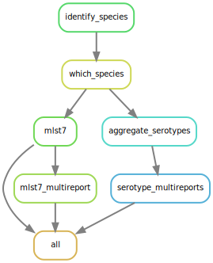

---
output:
  pdf_document: default
  html_document: default
---
# Juno-typing {#juno-typing}

<style>
body {
text-align: justify}
</style>

```{r setup_juno, include=FALSE}
knitr::opts_chunk$set(echo = TRUE, 
                      eval = FALSE)
```

```{r echo = FALSE, eval = TRUE}

# Parameters
parameters <- list("pipeline_name" = "Juno-typing")

```

```{r juno-typing-logo, out.width="70%", fig.align = 'center', echo = FALSE, eval = TRUE}
knitr::include_graphics("figures/juno_logo/juno_light/juno_typing_lightbg.png")
```

The goal of this pipeline is to perform bacterial typing (7-locus MLST and serotyping). It takes 2 types of files per sample as input:  

1. Two '.fastq' files (paired-end sequencing) derived from short-read sequencing. They should be already filtered and trimmed (for instance, with the Juno-pipeline).  

2. An assembly from the same sample in the form of a single '.fasta' file.  

Importantly, the Juno-typing pipeline works directly on output generated from the Juno-assembly pipeline. 

The Juno-typing pipeline will then perform the following steps:  

1. Recognizing the genus/species by using the [KmerFinder](https://bitbucket.org/genomicepidemiology/kmerfinder/src/master/) tool  

2. Once the genus and species is recognized, they are used to choose the appropriate 7-locus MLST schema and eventually a serotyper. The supported species for the 7-locus MLST can be found in the [database](https://bitbucket.org/genomicepidemiology/mlst_db/src/master/) generated by the [Center for Genomic Epidemiology](http://genomicepidemiology.org/) from the Technical University of Denmark  

3. 7-locus MLST by using the [MLST](https://bitbucket.org/genomicepidemiology/mlst/src/master/) tool  

4. If appropriate for the genus/species, the samples will be serotyped. The currently supported species are:
    - _Salmonella_ serotyper by using the [SeqSero2](https://journals.asm.org/doi/10.1128/aem.01746-19?permanently=true&) tool and an _in silico_ adaptation of the PCR suggested by [Tennant et al. 2010](https://journals.plos.org/plosntds/article?id=10.1371/journal.pntd.0000621) to differentiate monophasic from biphasic _S. typhimurium_.
    - _E. coli_ serotyper by using the [SerotypeFinder](https://bitbucket.org/genomicepidemiology/serotypefinder/src/master/) tool.
    - _S. pneumoniae_ serotyper by using the [Seroba](https://github.com/sanger-pathogens/seroba) tool.

```{r, fig.align='center', echo = FALSE, eval=TRUE}



```

<span style="color:red;">Disclaimer!!</span> Importantly, the genus and species are automatically detected from the processed reads (using `kmerFinder`) and the schema to use for the 7-locus MLST is chosen accordingly. The results of `kmerfinder` are also included in the output. However, <span style="font-weight:bold;">this pipeline is NOT meant for bacteria identification</span> and it has not been tested for it. Even if similar species would be misidentified, they would probably share the same MLST7 scheme. Following that thought, the correct choice of scheme has been tested, but not the correct species identification.  

## Handbook

### Requirements and preparation

See the [General Instructions for all pipelines](#general-instructions) first.  

- This pipeline needs two fastq file (R1 and R2) and an assembly (.fasta) files per sample. The fastq files should have been trimmed and filtered to remove low quality reads/bases. You could use the [Juno-assembly pipeline](#juno-assembly) for that. Moreover, that pipeline also provides the _de novo assembly_ for your samples and the output folder of the `Juno-assembly` pipeline can be used directly into the `Juno-typing` pipeline. If you, however, prefer to use any other tool for doing your assembly and trimming/filtering, make sure that the fastq files and fasta files have the same name (for instance, sample1_R1_001.fastq.gz, sample1_R1_001.fastq.gz and sample1.fasta). If that is not the case, the files may not be recognized as belonging to the same sample. Also, ALL THREE FILES SHOULD BE IN THE SAME FOLDER! If you have multiple samples, they should all be in the same input folder, NOT IN SUBFOLDERS. The only exception is if you use the `Juno-assembly` pipeline to pre-process your data. In that case, the pipeline will recognize the subfolders where the fastq files and the fasta files should be.


### Download the pipeline  

**YOU NEED TO DOWNLOAD THE PIPELINE ONCE OR EVERY TIME YOU WANT TO UPDATE IT**

Make sure to have followed the [instructions to set up conda](#set-conda) before installing any of our pipelines! 

Please follow the [instructions to download pipelines](#downloading-instructions) from the Juno team of the IDS-bioinformatics group. The `r parameters$pipeline_name` pipeline can be found in [this link](https://github.com/RIVM-bioinformatics/Juno-typing).  


### Install conda environment

**YOU NEED TO REINSTALL THE MASTER ENVIRONMENT EVERY TIME YOU UPDATE THE PIPELINE (everytime you download the code)**

1. Open a terminal. (Applications>terminal).  

2. Enter the folder of the pipeline using:  

```{bash}
cd /mnt/scratch_dir/<my_folder>/Juno-typing
```

3. If you already had a juno_typing environment before you need to delete the old one by using the command:

```{bash}
conda env remove -n juno_typing
```

If you had never created a juno_typing environment before, you can skip this step and go to step 4 instead.

4. Create a new environment for running Juno_typing by using the command:

```{bash}
conda env create -f envs/master_env.yaml
```

This step will take some time (few minutes).  

**Note:** If this step would take more than 1 hour, please kill the process (using `Ctrl + C` or `Ctrl + Z`) and refer to the section [General Troubleshooting](#general-troubleshooting). The first issue written there (Failure when installing master environment) often solves the problem. If, however, the problem persists, please contact me by [email](mailto:alejandra.hernandez.segura@rivm.nl).  


### Start the analysis. Basics

1. Open a terminal. (Applications>terminal).  

2. Enter the folder of the pipeline using:  

```{bash}
cd /mnt/scratch_dir/<my_folder>/Juno-typing
```

3. Activate juno_typing environment

```{bash}
conda activate juno_typing
```

If you run in trouble please see the [troubleshooting section for conda activate](#problems-conda-activate).  

4. Run the pipeline  

This can be done in two ways. The first one is just providing an input directory:  

```{bash}
python juno-typing -i /mnt/scratch_dir/<my_folder>/<my_data>/
```

The second one is providing as well a metadata (csv) file. This file should contain at least one column with the 'Sample' name (name of the file but removing [_S##]_R1.fastq.gz), a column called 'Genus' and a column called 'Species'. If a genus + species is provided for a sample, it will overwrite the species identification performed by this pipeline when choosing the scheme for MLST and the serotyper. Example metadata file:

| __Sample__ | __Genus__ | __Species__ |
| :---: | :--- | :--- |
| sample1 | Salmonella | enterica |


*Note:* The fastq files corresponding to this sample would probably be something like `sample1_S1_R1_0001.fastq.gz` and `sample2_S1_R1_0001.fastq.gz` and the fasta file `sample1.fasta`.

Please read the section [What to expect while running a Juno pipeline](#what-to-expect)

See the section [General Troubleshooting](#general-troubleshooting) for any problems you may encounter. 

**Note:** Do not keep all your data (including results) on the scratch_dir partition. You are allowed to keep 400GB max and with sequencing data, this can get full quite fast.

### Output 

A folder called `output/`, inside the folder of the pipeline, will be created. This folder will contain all the results and logging files of your analysis. There will be one folder per tool (`identify_species`, `mlst7` and `serotype`). Please refer to the manuals of every tool to interpret the results. In each one of these folders, there should be a sub-folder per sample and, for the case of mlst7 and serotype, also a csv file collecting the results of all the samples together: a `serotype/salmonella_serotype_multireport.csv`, `serotype/ecoli_serotype_multireport.csv` and `mlst7/mlst7_multireport.csv`. Although the results of `kmerfinder` are provided (in the subfolder `identify_species`), these have not been validated. They are used only to choose the right scheme for the MLST and the right serotyper (unless you provided metadata). If you would use the results of `kmerfinder` as a species identification tool, you do it under your own risk and you should be able to interpret correctly the results.  

*Note:* If you want your output to be stored in a folder with a different name or location, you can use the option `-o` ('o' from output) 

```{bash}
bash juno-typing -i /mnt/scratch_dir/<my_folder>/<my_data>/ -o /mnt/scratch_dir/<my_folder>/<my_results>/
```

Another very important output from the pipeline are the logging files and audit trail that contain information of the software versions used, the parameters used, the error messages, etc. They could be important for you if you want to publish or reproduce the analysis at a later time point and also to get help from the bioinformatics team if you were to run into trouble with the pipeline. Please read about these files [here](#general-output). 

### Troubleshooting for this pipeline

**Please read first the [General Troubleshooting](#general-troubleshooting) section!**

#### Other problems or failing rules  

The `r parameters$pipeline_name` pipeline is still in development which means that sometimes the process can fail.

Before contacting for help, try these two steps:

1. Re-run the pipeline again and see if the process continues. If it does, please keep re-running the pipeline until your analysis is finished or there is no longer progress. In this case, send an email after the pipeline is finished so I can troubleshoot the problem.

2. [Download](https://github.com/RIVM-bioinformatics/Juno-typing) the pipeline again and start from the beginning of this [handbook](#juno-typing). Sometimes there is an issue that has been resolved in newer versions of the pipeline.

If the pipeline still fails after these two steps, please inform me about the problem. Send an [e-mail](mailto:alejandra.hernandez.segura@rivm.nl) with the following content:

* The log and error files that can be found in the output folder
* The path to your input directory
* The path to where the pipeline is installed

**Note:** I cannot help you without this information, if information is missing there will be a delay in troubleshooting the problem.