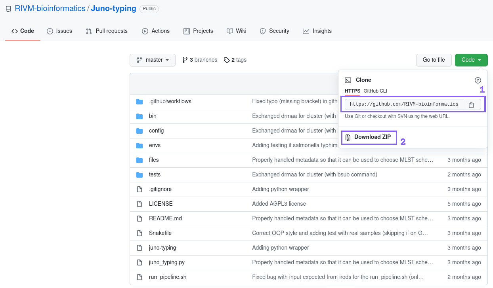
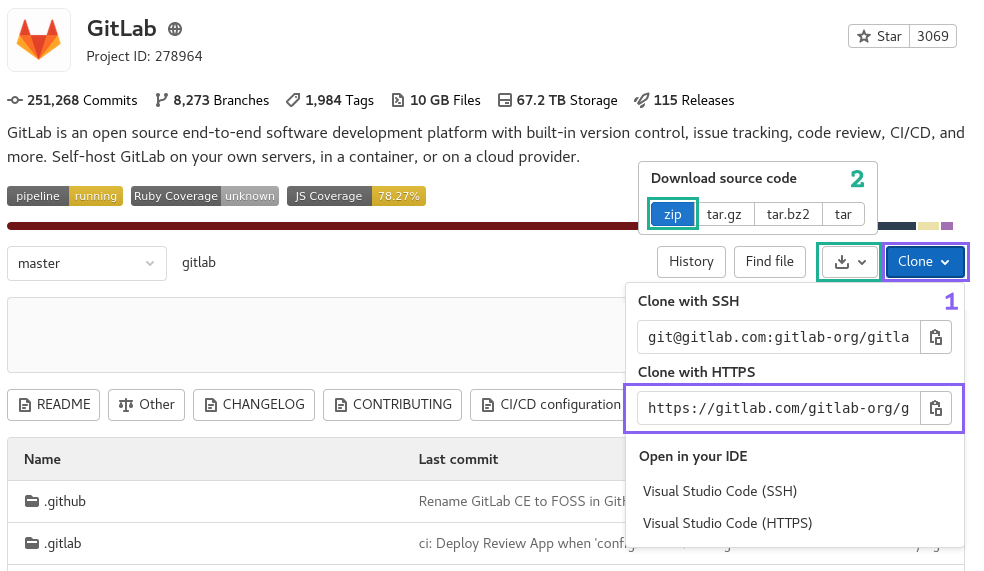
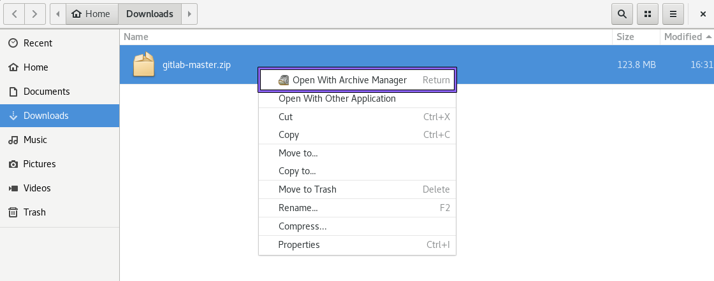
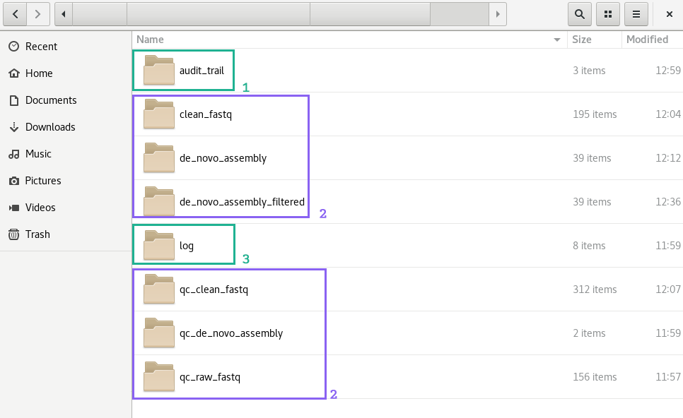

```{r}

knitr::opts_chunk$set(echo = TRUE, 
                      eval = FALSE,
                      error = FALSE,
                      message = FALSE,
                      warning = FALSE)
```

# Introduction and General Instructions

In this guide you will find the manuals of all the available pipelines for the Bacteriology and Parasitology Department of the IDS (RIVM). This guide is in continuous development, For additions and adjustments to this guide contact [Roxanne Wolthuis](roxanne.wolthuis@rivm.nl).

**Note:** This guide was written exclusively for users working at the RIVM, in specific the IDS department. If you are an external user it is necessary to adjust the parameters or scripts from the pipelines. Detailed information about the pipelines and parameters can be found in the repositories of each pipeline. All developed pipelines are available at the RIVM [Github](https://github.com/RIVM-bioinformatics). Please keep in mind that the main goal for our pipelines is to automate processes for the RIVM. This means we cannot give the personalized and fast-responding help that we give to users from the RIVM. If you have a question or need help please write an Issue in the corresponding GitHub repository and we will try to help as soon as possible.

## General Instructions for all pipelines {#general-instructions}

### Requirements and preparation

This guide is written based on the “Wetenschappelijke werkplek” at the RIVM. It is possible to run the Juno pipelines on your laptop, but this requires additional steps that are not listed in this guide.

__1. Placement of the data__  
All data should be placed in one folder within the Biogrid folder (`/data/BioGrid/your_folder/your_data/`)or scratch_dir folder (`/mnt/scratch_dir/your_folder/your_data`). Sub folders are not allowed. It is advised to store your data in the scratch_dir folder, this will make the analysis faster. After analysis it is possible to copy the output to the Biogrid folder.

__2. Naming restrictions on the folders__  
In order to successfully run the Juno pipelines it is necessary to use the correct file names for all the folders in your input path. The input path is the path that leads to your input directory. For example `/mnt/scratch_dir/your_folder/your_data`. All folder names inside this path can only contain letters, numbers or underscores. Using spaces, different characters or special symbols inside your folder will cancel the analysis, because the Juno pipelines cannot recognize these kinds of folder names.

__3. File format__  
The files in the input need to have the right format. If you have .fastq files the extensions can be: `.fastq`, `.fq`, `.fastq.gz` or `.fq.gz`. If you have .fasta files the extension can be: `.fasta`. In some cases it is possible to use both .fasta and .fastq files as input.

__4. Naming restrictions on the files__  
Not only the folder names, but also the names of the input files have some restrictions. The file names can contain letters, numbers and underscores. If you are using .fastq files, the file name always has to end with _R1,  _R2, _1 or _2. If you use these ends in other places in the file name the pipeline will crash. Below is a good and a bad example of file names. If you use both file formats as input it is important that the files have identical names(except for the part that indicates the read of the .fastq file(R1 and R2).

Good file name:  
```{bash}
IBESS11_S13_L001_R1.fastq.gz
```

Bad file name:  
```{bash}
IBESS11_1_S13_L001_R1.fastq.gz
```

Example of file names by using both .fastq and .fasta as input:  
```{bash}
IBESS11_S13_L001_R1.fastq.gz
IBESS11_S13_L001_R2.fastq.gz
IBESS11_S13_L001.fasta
```

### Downloading pipelines {#downloading-instructions}

All Juno pipelines are stored in [Github](https://github.com/RIVM-bioinformatics) or the [internal Gitlab](https://gitl01-int-p.rivm.nl/) of the RIVM. The Juno pipelines inside GitHub are publicly accessible. The Juno pipelines in the internal Gitlab can only be accessed by users that are inside of the servers or environments of the RIVM. You can enter the internal Gitlab with your RIVM log in details.

**Note:** If you download one of the Juno pipelines make sure to download it into the same partition to where your data is stored, preferentially scratch_dir. The instruction on where to retrieve the Juno pipeline can be found on the documentation page of each of the pipelines.

#### Download through Github/Gitlab website
 - Go to the documentation page of the pipeline
 - Click the Github or Gitlab link
     - For Github → Click the green “Code” button on the page and click on “Download zip”([Figure 1.1](#github-fig) step 2)
     - For Gitlab → Click the white “Download” button click on “Download zip”([Figure 1.3](#gitlab-fig) step 2)
 - The zip file will now be in your Downloads folder, move the zip file to BioGrid partition or the scratch_dir partition. The download should be placed in the same partition as where your data is stored
 - Extract the files of the zip file. In the ‘Wetenschappelijke Werkplek’ this can be done by right clicking the downloaded zip file, then “Open with Archive Manager” and then press “Extract” on the two windows that will consecutively appear ([Figure 1.2](#extract-fig)).
 
```{r github-fig, echo = FALSE, eval = TRUE, fig.cap = "Step 1 shows where to retrieve the Github clone link. Step 2 shows where to retrieve the .zip file."}

```

```{r gitlab-fig, echo = FALSE, eval = TRUE, fig.cap = "Step 1 shows where to retrieve the Gitlab clone link. Step 2 shows where to retrieve the .zip file."}

```

```{r extract-fig, echo = FALSE, eval = TRUE, fig.cap = "Unzipping a repository in the Wetenschappelijke Werkplek."}

```

#### Download through command line
 - In the “Wetenschappelijke Werkplek” go to Applications --> System Tools --> Open the Terminal([Figure 1.4](#terminal-fig))
 - In the terminal, use the cd command to navigate towards the location where you want to download the pipeline  
```{bash}
cd /mnt/scratch_dir/your_folder/
```
 - Get the url of the pipeline
     - For Github → Click on the green “Code” button and copy the link ([Figure 1.1](#github-fig) step 1)
     - For Gitlab → Click on the blue “Clone” button and copy the link ([Figure 1.3](#gitlab-fig) step 1)
 - Use the git clone command to download the pipeline  
```{bash}
git clone https://github.com/link_to_clone.git
``` 
 - The pipeline will ask for your username and password, if you have access and the log in details are correctly entered the pipeline will be downloaded and unzipped in the folder you used.

**Note:** Every git url that is used to clone a repository always ends with .git

```{r terminal-fig, echo = FALSE, eval = TRUE, fig.cap = "Opening a terminal inside the Wetenschappelijke Werkplek."}
knitr::include_graphics("figures/schreenshot_terminal.png")
```

### What to expect while running a Juno pipeline {#what-to-expect}  

The Juno pipelines usually run automated. Minimum input of the user is required. Detailed information on the required input can be found in the section for the specific pipeline. Sometimes a pipeline can ask for input from the user to agree on installing software or a database ([Figure 1.5](#installation-fig) step 1), if you get asked to give permission, please do so in order to run the pipeline. This is most often in the form of pressing y followed by enter ([Figure 1.5](#installation-fig) step 2).

The first time a Juno pipeline is executed, the preparation might take longer than expected. This is due to the installation of the basic software that is required for the pipeline to run. Be patient! You can recognize that the pipeline is still preparing when it shows a blinking box ([Figure 1.5](#installation-fig) step 3) or when it keeps printing lines inside the terminal. If the installation takes longer than 1 hour check the section [General Troubleshooting](#general-troubleshooting).

```{r installation-fig, echo = FALSE, eval = TRUE, fig.cap = "Screenshot of the Juno-typing pipeline in the terminal. The pipeline asks to create an environment(step 1). User input is required. To proceed the pipeline press y followed by enter. If executed correctly the pipeline will now show that it is creating the environment(step 2). The blinking box at the bottom indicates that the pipeline is still installing/updating(step 3)."}
knitr::include_graphics("figures/show_installation.png")
```

After installation the Juno pipeline will start running. Now the terminal shows <span style="color:#f4d03f;background:#2e3131;padding:5px">yellow</span> and/or <span style="color:#00b16a;background:#2e3131;padding:5px">green</span> messages. These messages indicate that the pipeline is being executed ([Figure 1.6](#snakemake-complete-run-fig)). At the start of the yellow messages the number of steps is shown ([Figure 1.6](#snakemake-complete-run-fig) step 1).  The amount of steps indicate the progress of the pipeline in %. Once the pipeline is finished there will be a message printed that all the steps are performed ([Figure 1.6](#snakemake-complete-run-fig) step 2).

```{r snakemake-complete-run-fig, echo = FALSE, eval = TRUE, fig.cap = "Screenshot of the Juno AMR pipeline in the terminal. The pipeline is executing all required jobs to create the requested results. The terminal shows a list of all the jobs that will be executed(step 1). Furthermore there is green and yellow text that shows the steps of the pipeline. At the bottom of the terminal there is a line that shows the pipeline is finished(step 2)."}
knitr::include_graphics("figures/snakemake_complete_run.png")
```

If a step fails, you will likely see <span style="color:#d64541;background:#2e3131;padding:5px">red</span> text appearing on the screen ([Figure 1.7](#snakemake-complete-run-fig)). The pipeline might proceed the other steps. If the pipeline fails check the section [General Troubleshooting](#general-troubleshooting) for more help or any other problems you may encounter.

```{r snakemake-error-fig, echo = FALSE, eval = TRUE, fig.cap = "Screenshot of the Juno AMR pipeline in the terminal. The pipeline failed on one of the steps. The red text shows an error message."}
knitr::include_graphics("figures/screenshot_snakemake_error.png")
```

**Note:** Do not keep all your data (including results) on the scratch_dir partition. You are allowed to keep 400GB max. With sequencing data, the storage space can get full quite fast.

### General output and log files for every pipeline {#general-output}  

The output of the Juno pipelines is divided over multiple folders inside the output folder. For each pipeline, there is an audit_trail folder, log folder, and result folder for each step or tool. The folders with results are probably the most interesting and contain most of the information you would use for analysis. The audit_trail folder contains information about the software, parameters, samples, and more. This kind of information can be useful for reproducibility or publications. The log folder contains information that is required for debugging and/or troubleshooting. For the developers, it is essential to have access to these files when an error occurs.  

All the output will be shortly discussed below. An example of an output folder is shown in [Figure 1.8](#snakemake-folder).

 - result folder(s)  
The `output` folder contains one result folder for each step that is performed by the pipeline. Inside the folder, there are results for each of the samples. The result output is different for each pipeline, you can check the pipeline's page or the tool that is used for more information about the output.

 - audit_trail folder  
The information in the `audit_trail` folder can be useful for the reproducibility of the pipeline and analysis.
     - The `log_conda.txt` file contains information about the software that was used to run the pipeline.
     - The `log_config.txt` enlists all parameters that were used to run the pipeline. 
     - The `log_git.txt` contains information about repositories or the code that was downloaded.
     - The `snakemake_report.html` contains an overview of all the steps that were performed with the samples in the input folder. It shows when the steps were performed, what output was produced, what software was used as well as some statistics about the run.  
     
 - log folder  
The `log/cluster/` or `log/drmaa/` folder contains .error and .out(log) files. For each step in the pipeline, there is one .error and one .out file. These files are useful to debug system/memory errors. If a step fails to perform and an error occurs, the .error file will show information about the error. The .out file contains information that is normally shown on the command line. This information can be originating from the tools that are used or from the pipeline itself. Sometimes these files can be empty, this happens if there were no problems or messages generated on the run or because the problem lies before the job/analysis was even started. You will need this output if you want to contact a developer when you run into problems. You can send the files or the location(example: `mnt/scratch-dir/mydirectory/output/log`) of the files when you contact the developer. 

**Note:** Do not delete the contents of the log folder.

```{r snakemake-folder, echo = FALSE, eval = TRUE, fig.cap = "Example of an output folder. 1 shows the audit_trail folder, 2 shows output folders per step or tool, 3 shows the log folder."}

```
