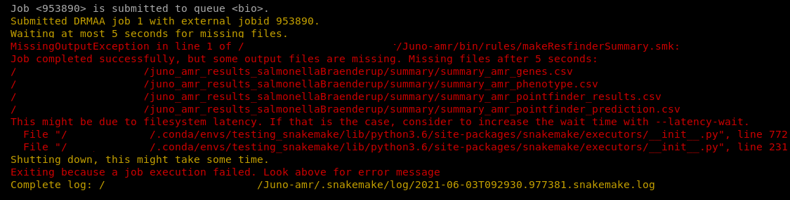

```{r}

knitr::opts_chunk$set(echo = TRUE, 
                      eval = FALSE,
                      error = FALSE,
                      message = FALSE,
                      warning = FALSE)
```


# Introduction and General Instructions

In this "book" you will find the handbooks of all the available pipelines for the Bacteriology and Parasitology Department of the IDS (RIVM). This handbook is in continuous development, so please keep that in mind and contact [Roxanne Wolthuis](mailto:roxanne.wolthuis@rivm.nl) if you wish to add/change something or if you need help with troubleshooting (please read the troubleshooting section for each pipeline first). 

<span style="color:#d64541;">Important Note!!</span> This handbook was written exclusively for people working at the RIVM (especially people at IDS). Some of the parameters or the way to run the pipeline would need to be changed for external people. Refer to the README section on the GitHub page of the corresponding pipeline. The pipelines that are enlisted as available through the internal GitLab from the RIVM are not accessible for external people. This might change in the future but for now that is the case. Equally, although the team would love to help external people to use our pipelines, we cannot give the personalized and fast-responding help that we give to people at the RIVM. If you do need help please write an Issue in the corresponding GitHub repository and we will try to help as soon as possible.  

## General Instructions for all pipelines {#general-instructions}

### Setting up conda {#set-conda}

If you are not used to `conda` environments yet, you may not have your `conda` software completely set-up. At the RIVM `conda` is always pre-installed in our Linux environment (Wettenschappelijke werkplek) but not always set up. You need to go through this step once and hopefully never again. If you do not do this, you may have problems installing/running some of our pipelines.  

To set up `conda` to work properly in the Wettenschappelijke werkplek at the RIVM you need to follow these steps:  

1. Go to the scratch_dir partition and make a folder with your RIVM user name. Replace <username> by your actual username (the RIVM one).

```
cd /mnt/scratch_dir
mkdir -p <username>
```

2. Then you can go inside the folder you just created and make extra folders where your `conda` environments will be stored:

```
cd /mnt/scratch_dir/<username>/
mkdir -p conda
mkdir -p conda/envs
mkdir -p conda/pkgs
```

3. The next step is a bit more difficult. First you move back to your home directory, then you "initiate" `conda` and finally you give it the paths where you want it to make your environments (the folders you just made in scratch_dir):

```
cd /home/<username>/
conda init bash
touch /home/<username>/.condarc
```

To add the paths you can do it from the command line using the `vim .condarc` editor if you are familiar with how `vim` works. If you don't know how to do that, you can simply go to your home directory by going to the menu "Places" > "Home" on the top left of your Linux desktop. 

```{r find_home_dir, echo = FALSE, eval = TRUE, fig.cap = "To find the home directory in RedHat Linux you need to go to the Menu 'Places' and then to 'Home'. There might be also a shortcut already on your desktop that you could follow as well."}

```

You can see some of the files/folders that you have on your desktop. The file that you want is called .condarc and it might not be visible yet. If you cannot see it, then you need to allow hidden files to be displayed. For that you can go to the menu (three parallel lines on the top right of the 'Places' window) and make sure to have marked the 'Show Hidden Files' option. You should now be able to see the .condarc file listed. 

```{r show_condarc, echo = FALSE, eval = TRUE, fig.cap = "To find the .condarc file you first need to go to the menu of Places (1), then check the box to Show Hidden Files (2) and finally look for the .condarc file (3)"}

```

Please open it by double-clicking the file name. A text editor should have opened. Finally, add or replace the following text with the correct paths (replace <username> with your RIVM user name, meaning the folders you just made in scratch_dir):

```
pkgs_dirs:
  - /mnt/scratch_dir/<username>/conda/pkgs
envs_dirs:
  - /mnt/scratch_dir/<username>/conda/envs
channel_priority: disabled
```

Now you are ready to make your `conda` environments. 

### Requirements and preparation

This handbook assumes that you are working at the “wettenschappelijke werkplek” environment at the RIVM. It is possible to run the pipeline in other settings and even on your laptop but you need extra steps that will not be enlisted here.  

- Placing of the data: Your data should all be placed in one single folder (no subfolders) in the BioGrid (`/data/BioGrid/<my_folder>/<my_data>/`) or in the scratch_dir folder (`/mnt/scratch_dir/<my_folder>/<my_data>/`). I strongly advice you to place it in the `scratch_dir` folder and to only copy it later to the BioGrid after the analysis. The run will be faster and therefore you will block the cluster less time for everyone else.  

- Make sure that the folder that you use as input (the one that contains your input data) has the right name. This means: the folder that contains your data can have any name you want provided that you only use letters, numbers or underscores. If your folder name contains different characters, it may not be recognized by the pipeline. **IMPORTANT:** Your folder name and the names of every folder and subfolder in its PATH (so all the folders and subfolders that you have to enter to reach your input folder) should NOT CONTAIN SPACES!!!!  

- Make sure that your files have the right format: if they are fastq files, they should have the extension (`.fastq`, `.fq`, `.fastq.gz` or `.fq.gz`). If they are fasta files, they should have the extension `.fasta`. Any other requirements in the input files will be specified in the section of that specific pipeline.  

### Downloading pipelines {#downloading-instructions}

All the bacteriology pipelines created by the IDS-bioinformatics group are stored in either [GitHub](https://github.com/RIVM-bioinformatics) or the [internal GitLab](https://gitl01-int-p.rivm.nl/) of the RIVM. Only people who belong to the RIVM and that are inside one of our servers/environments can access to the later one with their normal RIVM login details.  

If you are going to download a pipeline, please do so in the same partition that your data is (preferentially `scratch_dir`). Each pipeline handbook has the instructions on where to find the code (either GitHub or GitLab). You can download every pipeline through the website or through the command line:  

_GitHub website_  

1. Go to the website for the pipeline (check the section of the specific pipeline).  
2. Press the green button “Code” on the page and then click on “Download zip” (see [Figure 1.1](#github-fig) for explanation).  
3. A zip file (<pipeline_name>-master.zip) will have likely be downloaded on your “Downloads” folder. Please move this zip file to the `BioGrid` or the `scratch_dir` partitions, depending on where your data is.  
4. Extract the files of the zip file. In Linux this is normally done by pressing the left button of the mouse, then “Open with Archive Manager” and then press “Extract” on the two windows that will consecutively appear. You could then delete the zip file (see [Figure 1.2](#extract-fig) for explanation).   

```{r github-fig, echo = FALSE, eval = TRUE, fig.cap = "Pipelines can be downloaded directly from their GitHub website."}
knitr::include_graphics("figures/screenshot_download_github.png")
```

```{r extract-fig, echo = FALSE, eval = TRUE, fig.cap = "Unzipping a repository in Linux."}
knitr::include_graphics("figures/screenshot_unzip.png")
```

_GitLab website_  

1. Go to the website for the pipeline (check the section of the specific pipeline).   
2. Press the small white button with a cloud and a downwards arrow. In the drop-down menu, choose "Download zip" (see [Figure 1.3](#gitlab-fig) for explanation).   
3. A zip file (<pipeline_name>-master.zip) will have likely be downloaded on your “Downloads” folder. Please move this zip file to the `BioGrid` or the `scratch_dir` partitions, depending on where your data is.  
4. Extract the files of the zip file. In Linux this is normally done by pressing the left button of the mouse, then “Open with Archive Manager” and then press “Extract” on the two windows that will consecutively appear. You could then delete the zip file (see [Figure 1.2](#extract-fig) above for explanation).  

```{r gitlab-fig, echo = FALSE, eval = TRUE, fig.cap = "Pipelines can be downloaded directly from their GitLab website."}

```

_Command-line_   

Any member of the RIVM has a (RIVM-specific) GitLab account. You can log in with the same credentials that you use for accessing your workspaces. In the case of pipelines hosted on GitHub, you may need a free GitHub account.     

1.  Open the “terminal” (you could also open “terminator”) by going to the “Applications” menu of the linux environment.  

```{r commandline-fig, echo = FALSE, eval = TRUE, fig.cap = "Pipelines can be downloaded directly from their GitLab website."}
knitr::include_graphics("figures/schreenshot_terminal.png")
```

2. Go to the location where you want to download the pipeline using the command ‘cd’. For instance:  

```{bash, eval = FALSE}
cd /mnt/scratch_dir/<my_folder>/
```
**Note:** mind the slash at the beginning of the path

3. Download the pipeline using the `git clone` command  

```{bash, eval = FALSE}

git clone <url_to_the_pipeline>.git

```
**Note**: notice that I added ".git" to the URL of the pipeline.  

You will be asked to give your credentials (username + password) and then the (already unzipped) pipeline should have been downloaded in your current folder. 

### What to expect while running a Juno pipeline {#what-to-expect}  

The Juno pipelines usually run easily with minimum input of the user required. Detailed information on the required input can be found in the section for the specific pipeline. Sometimes a pipeline can ask for input from the user to agree on installing software or a database ([Figure 1.5](#installation-fig) step 1), if you get asked to give permission, please do so in order to run the pipeline. This is most often in the form of pressing y followed by enter ([Figure 1.5](#installation-fig) step 2).

The first time a Juno pipeline is executed, the preparation might take longer than expected. This is due to the installation of the basic software that is required for the pipeline to run. Be patient! You can recognize that the pipeline is still preparing when it shows a blinking box ([Figure 1.5](#installation-fig) step 3) or when it keeps printing lines inside the terminal. If the installation takes longer than 1 hour check the section [General Troubleshooting](#general-troubleshooting).

```{r installation-fig, echo = FALSE, eval = TRUE, fig.cap = "Screenshot of the Juno-typing pipeline in the terminal. The pipeline asks to create an environment(step 1). User input is required. To proceed the pipeline press y followed by enter. If executed correctly the pipeline will now show that it is creating the environment(step 2). The blinking box at the bottom indicates that the pipeline is still installing/updating(step 3)."}
knitr::include_graphics("figures/show_installation.png")
```

After installation the Juno pipeline will start running. Now the terminal shows <span style="color:#f4d03f;background:#2e3131;padding:5px">yellow</span> and/or <span style="color:#00b16a;background:#2e3131;padding:5px">green</span> messages. These messages indicate that the pipeline is being executed ([Figure 1.6](#snakemake-complete-run-fig)). At the start of the yellow messages the number of steps is shown ([Figure 1.6](#snakemake-complete-run-fig) step 1).  The amount of steps indicate the progress of the pipeline in %. Once the pipeline is finished there will be a message printed that all the steps are performed ([Figure 1.6](#snakemake-complete-run-fig) step 2).

```{r snakemake-complete-run-fig, echo = FALSE, eval = TRUE, fig.cap = "Screenshot of the Juno AMR pipeline in the terminal. The pipeline is executing all required jobs to create the requested results. The terminal shows a list of all the jobs that will be executed(step 1). Furthermore there is green and yellow text that shows the steps of the pipeline. At the bottom of the terminal there is a line that shows the pipeline is finished(step 2)."}
knitr::include_graphics("figures/snakemake_complete_run.png")
```

If a step fails, you will likely see <span style="color:#d64541;background:#2e3131;padding:5px">red</span> text appearing on the screen ([Figure 1.7](#snakemake-complete-run-fig)). The pipeline might proceed the other steps. If the pipeline fails check the section [General Troubleshooting](#general-troubleshooting) for more help or any other problems you may encounter.

```{r snakemake-error-fig, echo = FALSE, eval = TRUE, fig.cap = "Screenshot of the Juno AMR pipeline in the terminal. The pipeline failed on one of the steps. The red text shows an error message."}

```

**Note:** Do not keep all your data (including results) on the scratch_dir partition. You are allowed to keep 400GB max. With sequencing data, the storage space can get full quite fast.

**Note2:** In this manual, a couple of non-Juno pipelines are included. They work mostly in the same way but the differences are in the design and maintenance (the Juno pipelines are named like that and they are very actively maintained, the others less so).  

### General output and log files for every pipeline {#general-output}  

Every pipeline (with few exceptions) generates some extra output that is not essential for your analysis but that it is required for debugging/troubleshooting. Especially, if you are contacting someone at the IDS-bioinformatics team, we expect you to have these files at hand or to also send the location where they can be found (make sure that we have right to access that location or move them to a shared folder where they can be accessed).  

- The `log/` subfolder is located inside your output directory. It contains one file per every step performed by the pipeline for each sample. There you can find error messages or some information of what happened during each step. The messages are not always easy to interpret, but they often have clues on why a job/analysis failed. Sometimes the log files for each tool (and sample) are empty because either, there were no problems or messages generated on the run or because the problem lies before the job/analysis was even started. You can look at them of course, but it is ok if you do not understand the messages. However, for us as bioinformaticians it is essential to have access to these files when something goes wrong inside one of the scripts/tools used.

- The `log/cluster/` or `log/drmaa/` subfolder is also inside the output directory and inside the log subdirectory. Here you can find other type of logging files of any job performed by the pipeline. This is even more technical logging but it can be veru useful to debug system errors, problems with memory, etc.  

- The `audit_trail` or `results` subfolders are also located inside the output directory. They contain contain 4 very important files for trace-ability of your samples. The `log_conda.txt file` contains information about the software that was necessary and that was contained in your environment. This means basically the software that would be needed to reproduce the same circumstances in which the pipeline was run and how it can be reproduced. The `log_config.txt` file is even more informative. It enlists all the parameters used to run the pipeline. In case months later you forgot how you got the results you did or you just want to know some details about the analyses, they are all stored there. The `log_git.txt` has information about the repository or the code that was downloaded. It tells you exactly how it was downloaded so you can reproduce it at a later time point. Finally, the `snakemake_report.html` has a nice overview of the different steps that were performed with your samples, when were they performed, which output was produced and which software was used, as well as some statistics on how the run went. 

Even though you would not look at this output regularly, it is useful for us as bioinformaticians to be able to help you if a problem would arise. However, <span style="font-weight:bold;">they are also useful for you!</span> Especially the `audit_trail` has the information you would need to put in a publication (software versions, parameters, etc.). <span style="font-weight:bold;">Please do not delete them</span> and know they are important.  